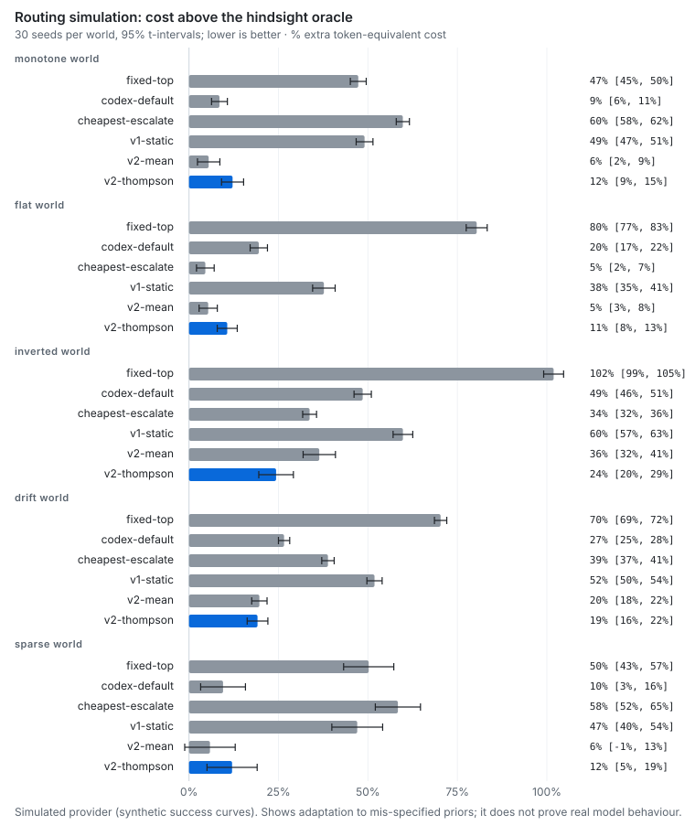
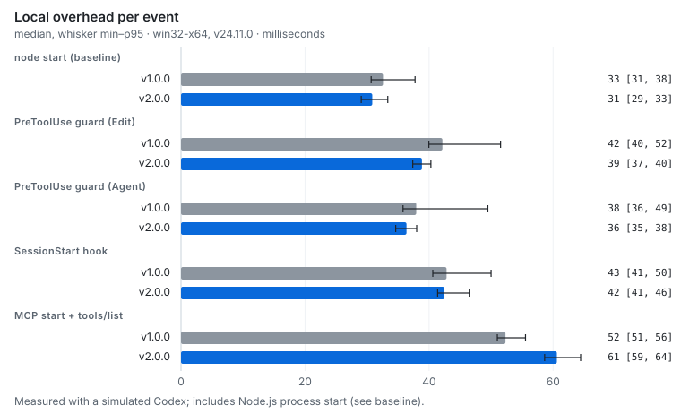

<div align="center">

### CLAUDE CODE × OPENAI CODEX

# tandem ⚡

### Two brains. One terminal. No stand-up meetings.

**Claude leads. Codex builds in the background. Tandem handles the teamwork.**

Adaptive model routing, parallel jobs, test-backed delegation, and shared project memory — inside the Claude Code experience you already use.

[**Get started ↓**](#get-started) · [**See the evidence ↓**](#the-evidence) · [**Explore the architecture ↗**](docs/ARCHITECTURE.md)

<p>
  <a href="https://github.com/brutalstein/tandem/actions/workflows/ci.yml"></a>
  <a href="https://github.com/brutalstein/tandem/actions/workflows/codeql.yml"></a>
  <a href="LICENSE"></a>
  
</p>

</div>

---

## One conversation. A whole engineering team.

| | What Tandem actually does |
|:--|:--|
| 🧠 **Thinks before spending** | Chooses an available Codex model and reasoning level for the job. Learns from outcomes. |
| 🌳 **Works in parallel** | Coordinates file ownership and Git worktrees so agents don't write over each other. |
| 🧪 **Asks for receipts** | Runs project tests instead of trusting an AI's “done ✅”. |
| 🧩 **Remembers the important bits** | Shares project decisions and findings, with sources and stale-data checks. |

**The workflow:** You talk to Claude → Claude delegates a well-scoped task → Codex works → Tandem verifies → Claude reports back.

No separate Codex window. No human-powered copy-paste API.

---

## The evidence

Real numbers, readable charts, and the fine print. Because **“trust me, bro” isn't a benchmark.**

### 01 / Does smarter routing help?

Tandem doesn't automatically pick the biggest model. It estimates the cost of *getting a result that passes checks* and adjusts as it learns.

**Routing study · 30 seeds × 5 simulated environments**

| Strategy | Average cost above a hindsight oracle |
|:--|--:|
| **Tandem v2** | **15.7%** |
| Strongest model, medium reasoning | 22.5% |
| Tandem v1 static routing | 49.1% |
| Strongest model, maximum reasoning | 70.0% |

**Lower is better.** These numbers come from synthetic simulations, *not* a real-world guarantee of token savings.

<div align="center">
  <a href="docs/charts/routing-regret.svg">
    
  </a>
</div>

**[Open the chart full-size ↗](docs/charts/routing-regret.svg)** · [Methodology, confidence intervals & raw data](docs/ROUTING.md)

### 02 / What's the overhead?

It should help your editor, not become your editor's second job.

**Measured locally on Windows · median latency**

| Operation | Measured result |
|:--|--:|
| Extra time per edit guard (above Node startup) | **5–11 ms** |
| MCP server startup | **61 ms** |
| Idle MCP server memory | **49.1 MB** |

<div align="center">
  <a href="docs/charts/overhead.svg">
    
  </a>
</div>

**[Open the chart full-size ↗](docs/charts/overhead.svg)** · [Measurements & environment](docs/BENCHMARKS.md)

### 03 / Does it work outside a slide deck?

| Validation | Recorded outcome |
|:--|--:|
| Deterministic tests (simulated Codex) | **62 / 62** |
| Real Codex integration checks | **8 / 8** |
| Real plugin installation lifecycle checks | **12 / 12** |

The deterministic suite is exercised in [GitHub Actions](https://github.com/brutalstein/tandem/actions) across Windows, Linux, and macOS. Real-provider checks are reported separately.

**Real-world pilot:** Tandem used fewer Codex tokens on two read-only tasks, but delegating a coding task from Claude **roughly doubled completion time** in one comparison. The sample is too small for broad claims. We publish the awkward numbers too.

[Full benchmark report](docs/BENCHMARKS.md) · [Verification notes](docs/VERIFICATION.md) · [Release readiness](docs/RELEASE_READINESS.md)

---

## Get started

**You need:** [Claude Code](https://code.claude.com/docs/en/overview), [Codex CLI](https://github.com/openai/codex), Node.js 20+, and Git.

**1. Install Codex and connect your account**

```bash
npm install -g @openai/codex
codex login
```

**2. Add Tandem to Claude Code**

```bash
claude plugin marketplace add brutalstein/tandem
claude plugin install tandem@tandem-local
```

**3. Restart Claude Code, then check**

```text
/tandem:status
```

**That's it.** Keep talking to Claude as normal. When you want to be explicit:

```text
/tandem:delegate Fix the failing tests and verify the result
/tandem:review
/tandem:memory audit
```

Configure model ceilings, parallelism, or the speed-versus-token objective through Claude Code's `/plugin` settings.

<details>
<summary><b>Under the hood — for people who like opening the engine bay</b></summary>

Claude Code plugin + MCP + Codex CLI + Node.js + Git. Expected-cost routing, cross-session job coordination, isolated worktrees, independent verification, and project memory. No third-party runtime packages.

[Architecture](docs/ARCHITECTURE.md) · [Routing math](docs/ROUTING.md) · [Security & limitations](SECURITY.md) · [Contributing](CONTRIBUTING.md)

</details>

---

<div align="center">

**Less model juggling. More shipping.**

MIT licensed · Tandem v2 · Uses your own Claude and Codex accounts, quotas included. No quota sorcery.

</div>
